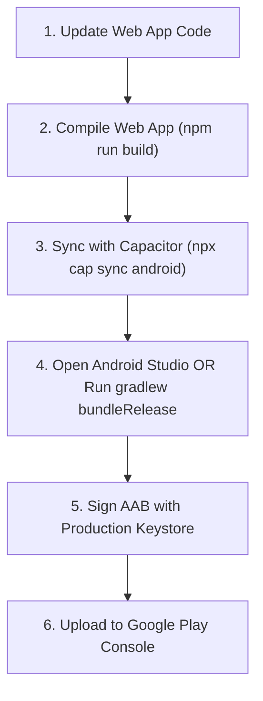

# 🚀 Guide: Generating, Signing, and Uploading your Android App Bundle (.AAB)

This guide provides a comprehensive walkthrough for signing and publishing your **PeriRisk Assessment** Android application. We have already generated a raw release **Android App Bundle (.AAB)** file located locally at:
📁 **`release/peririsk-release.aab`**

Use this guide to sign it, configure your keystore, and upload it to the Google Play Store.

---

## 📌 Section 1: History Analysis (How the APK was Created)

To build the APK previously, the workspace utilized a hybrid approach leveraging the **Capacitor 8** hybrid mobile platform:
1. **Web App Build**: Compiling the React + Vite frontend source code to a static production folder (`dist/`) via `npm run build`.
2. **Capacitor Synchronization**: Running `npx cap sync android` to copy the compiled web assets and plugins into the Gradle-based native Android container (`android/`).
3. **Gradle Compilation**: Invoking the local Android Gradle compiler (via wrapper `gradlew.bat assembleDebug` or standard debug configurations) under Java 21 to produce a debug-signed **`app-debug.apk`** file.

---

## 🔑 Section 2: Step-by-Step Signing & Android Studio Guide

To upload an application to the Google Play Store, it **must** be packaged as an **Android App Bundle (.aab)** and signed using a secure, unique production **Keystore file**. 

### Step 1: Open the Project in Android Studio
1. Launch **Android Studio**.
2. Select **Open** (or **File > Open**).
3. Navigate to your project directory: `C:\Users\saxen\OneDrive\Desktop\PeriRiskAssesment`.
4. Select the **`android`** subfolder (the one containing `build.gradle`, `app/`, etc.) and click **OK**.
5. Wait for Android Studio to finish indexing and running the Gradle sync.

---

### Step 2: Create a New Keystore Properly
> [!IMPORTANT]
> A Keystore is a database of cryptographic keys. If you lose this file or its passwords, you will **not** be able to update your app on the Google Play Store in the future. Keep it safe!

1. In the Android Studio top menu, navigate to **Build > Generate Signed Bundle / APK...**
2. In the dialog, select **Android App Bundle** and click **Next**.
3. Under **Key store path**, click **Create new...**
4. Fill out the **New Key Store** dialog:
   * **Key store path**: Click the folder icon and choose a location *outside* your project's Git repository (e.g., `C:\Users\saxen\android-keys\peririsk.jks`).
   * **Password**: Create a secure password for the Keystore (write this down!).
   * **Alias**: Enter a memorable name for your key (e.g., `peririsk-key`).
   * **Key Password**: Create a second password for the key itself (or check the box/use the same password as the keystore).
   * **Validity (years)**: Leave at the default `25` (or higher).
   * **Certificate**: Fill out at least one field (e.g., First and Last Name).
5. Click **OK** to create the keystore.

---

### Step 3: Select Build Variants & Generate the Signed AAB
1. After creating the key, you will be returned to the **Generate Signed Bundle / APK** screen with your details filled in. Click **Next**.
2. Under **Build Variants**, select **`release`**.
3. Under **Destination Folder**, choose where you want Android Studio to output the signed file (default is `android/app/release`).
4. Click **Finish**.
5. Android Studio will compile, shrink, optimize, and cryptographically sign your App Bundle. Once finished, a notification popup will appear saying `Generate Signed Bundle: Bundle(s) generated successfully`. Click the **Locate** link in the popup to open the folder containing your signed **`app-release.aab`**!

---

## 🛠️ Section 3: Difference Between Debug and Release Builds

| Feature | Debug Build (`debug`) | Release Build (`release`) |
| :--- | :--- | :--- |
| **Signing Key** | Signed automatically with a generic local `debug.keystore` | Must be signed with your custom, secure production keystore |
| **Debuggability** | `debuggable true` (allows inspection in Chrome DevTools / Safari) | `debuggable false` (securely locked down to prevent tampering) |
| **Optimization** | Minimal optimization to keep compile times fast | Minified and obfuscated via **R8 / ProGuard** to reduce size and protect code |
| **Performance** | Standard execution, includes developer warnings | Highly optimized bytecode and resources for faster load times |
| **Play Store** | Rejected by Google Play Console | Accepted by Google Play Console |

---

## 🛡️ Section 4: Best Practices for Keystore Safety

1. **Add to `.gitignore`**: Never commit your `.jks` or `.keystore` files, or any password configuration files, to your public or private Git repository. Add this line to your project's `.gitignore` file:
   ```env
   *.jks
   *.keystore
   ```
2. **Secure Cloud Backups**: Backup your keystore file in at least two separate secure locations (e.g., an encrypted vault like 1Password or Bitwarden, and a secure secondary cloud drive).
3. **Auto-Signing via Gradle (Safe Method)**: Instead of manually inputting passwords in Android Studio every time, you can configure your `android/app/build.gradle` to fetch signing credentials from environment variables or a local untracked `local.properties` file:
   ```groovy
   // Inside android/app/build.gradle
   signingConfigs {
       release {
           storeFile file(System.getenv("SIGNING_STORE_FILE") ?: "../peririsk.jks")
           storePassword System.getenv("SIGNING_STORE_PASSWORD") ?: "your-store-password"
           keyAlias System.getenv("SIGNING_KEY_ALIAS") ?: "peririsk-key"
           keyPassword System.getenv("SIGNING_KEY_PASSWORD") ?: "your-key-password"
       }
   }
   buildTypes {
       release {
           signingConfig signingConfigs.release
           minifyEnabled true
           proguardFiles getDefaultProguardFile('proguard-android-optimize.txt'), 'proguard-rules.pro'
       }
   }
   ```

---

## 🌐 Section 5: How to Upload the .AAB to the Google Play Console

1. Navigate to the [Google Play Console](https://play.google.com/console/) and sign in.
2. Select your application from the dashboard (or click **Create app** if starting fresh).
3. In the left navigation sidebar, scroll down to **Release** and select **Production** (or **Closed testing** / **Internal testing** for staging).
4. Click **Create new release** in the top-right corner.
5. Under **Play App Signing**, ensure it is enabled (Google manages the encryption delivery key, which is standard and recommended for all new apps).
6. Under **App bundles**, click **Upload** and select your signed **`app-release.aab`** file.
7. Fill out the **Release name** and write your **Release notes** describing what is new in this build.
8. Click **Save as draft**, then **Review release**.
9. Click **Start rollout to Production** to submit your app for Google's review!

---

## 🔄 Section 6: Recommended Production Build Workflow

Whenever you make updates to your web app frontend and want to release a new version to the Play Store, follow this standard workflow:



### Direct CLI Build Commands:
If you have configured Gradle auto-signing (from Section 4), you can bypass Android Studio entirely and generate a fully signed release App Bundle directly from your terminal using:
```powershell
# 1. Build and sync frontend
npm run build
npx cap sync android

# 2. Build release bundle
cd android
.\gradlew.bat bundleRelease
```

---

## 🩺 Section 7: Common Gradle & Build Fixes

* **Java Version Errors**: Ensure your `JAVA_HOME` environment variable points to a full **JDK 21** installation (which includes the `jlink` utility), not just a JRE runtime.
* **SDK Version Conflicts**: If you get AAR metadata errors, ensure your `compileSdkVersion` and `targetSdkVersion` in `android/variables.gradle` match the minimum requirements of modern Android libraries (we have updated yours to `36` to perfectly support Capacitor 8's packages).
* **Locked File Directories**: If you receive `Unable to delete directory` or locked folder errors, stop any running `npm run dev` servers or background emulator processes, then run `.\gradlew.bat clean`.
